# 侦测器 observer
---
## 一、侦测器的方块状态

侦测器只有 2 个方块状态：

| 属性              | 类型              | 含义                                             | 默认值            |
| ----------------- | ----------------- | ------------------------------------------------ | ----------------- |
| 朝向`FACING`      | `Direction`       | 侦测器检测面的朝向，也就是输入侧；输出侧在反方向 | `Direction.SOUTH` |
| 激活状态`POWERED` | `BooleanProperty` | 是否正在输出红石信号                             | `false`           |

- `FACING` 指向的是检测面/输入面，红石输出端在 `FACING.getOpposite()`。
- 放置时，`FACING` 取玩家视线方向，因此检测面会朝向玩家，输出面背对玩家。

---
   **侦测器响应且仅响应 PP 更新（方块状态变化）。**


## 二.计划刻的特点
这里是为没有详细了解计划刻事件的人准备的,如果您已经对计划刻事件有所了解,完全可以跳过这一部分

简单来说,计划刻就是方块向游戏请求一个计划在指定游戏刻后执行的任务，而规划请求的这项计划任务被称为计划刻

具体计划刻的执行时间的计算为:
```
实际执行时间 = 当天时间 + 计划刻延迟
```
一个方块任意时刻,只能拥有一个计划刻,已经有一个计划刻后,添加计划刻会失败

**特别的:如果侦测器已有的计划刻事件在本游戏刻内执行,那在该游戏刻还是可以添加新的计划刻的**

同一游戏刻,计划刻的执行顺序:
- 先看计划刻优先级,小的优先
- 再看计划刻添加的顺序,先添加的优先
侦测器的优先级都是0,所以可以看为哪个侦测器先添加计划刻事件,哪个侦测器先执行计划刻事件.

##  三 、侦测器计划刻的添加
当侦测器收到来自面向方向`FACING`的PP更新时开始自检：
   - 侦测器不是亮起状态  
   - 不存在已有的计划刻（本游戏刻内不算）。  
  
   满足以上条件时，添加` 2 gt `后的计划刻。优先级为默认的0`NORMAL`

##  四、侦测器执行计划刻时的逻辑

当一个侦测器执行自己的计划刻事件时，它首先会检查自己的激活状态`POWERED`
   - **如果现在是熄灭状态`POWERED == False`**：  
     1. 把激活状态`POWERED`设置为激活`True`（发出PP 更新）；  
     2. 添加延迟为 2 gt 的计划刻事件，优先级为默认的0`NORMAL`  
     3. 向有屁股的方向发出 NC 更新。 
   - **如果现在是亮起状态`POWERED == True`**：  
     1. 将自身激活状态`POWERED`设置为熄灭`False`（发出PP 更新）；  
     2. 向有屁股的方向发出 NC 更新。 

> 简要来说，侦测器在执行计划刻的时候会反转自己的状态，如果执行计划刻前是亮起状态还会添加一个2gt的计划刻事件

请牢记侦测器执行计划刻时的顺序：
**1. 状态改变发出PP更新
2. 为自己添加计划刻事件
3. 发出NC更新**


##  五、被活塞推动时的处理
侦测器被活塞推动并不会销毁原来位置已经添加的计划刻事件。 

具体侦测器被活塞推动可以分为活塞推动熄灭侦测器，活塞推动亮起侦测器两种：
**活塞推动熄灭侦测器：**
   - 一个熄灭侦测器被活塞推动，在熄灭侦测器对应的 b36 固化的方块实体阶段，会添加一个延迟为 2 gt 的计划刻。 
   
**活塞推动亮起侦测器：**
   - 一个亮起的侦测器被活塞推动，且当前有待执行的计划刻。则在BE阶段活塞推动开始，亮起的侦测器被活塞移除时，侦测器位置会发送一次代表侦测器熄灭的 NC 更新。
> 在一些无珊瑚的tnt复制地毯复制中就利用了这个NC更新
   - 但是亮起的侦测器被活塞推动的时候并不会马上熄灭，而是在 b36 到位的时候再对这个方块判断：
     - 如果这个到位的方块是一个亮起的侦测器，
     - 并且该到位位置没有侦测器的计划刻
 - 
   就会熄灭这个亮起的侦测器。此时这个侦测器不会添加新的计划刻事件。
   > 出于某种原因，亮起侦测器在到位的时候似乎不会发出任何PP更新以及NC更新，你可以用这个特性制作脸贴脸不亮的侦测器


## 六、侦测器链中计划刻传递的方式

一个侦测器一个看着另一个，拼成一条长链的模式称作侦测器链

许多侦测器链看似其中侦测器的亮灭关系相同，但是其实里面传递的计划刻添加执行顺序有微时序上的差别，这个差别因为都是在计划刻阶段的差别，所以用侦测器链激活某些计划刻元件的时候常会出现难以预测的现象

而一个一个分析侦测器链中的侦测器实际上是极为困难的，很容易就会陷入侦测器计划刻添加又执行的计划刻地狱中。
因此我们下面来总结一些常见的侦测器链中传递的信号模式。

### 6.1.1侦测器自熄灭模式

前面提到，侦测器在执行计划刻的时候，如果自己是熄灭的状态（**想要亮起**），在状态变化由熄灭变为亮起`powered:False->True`发出PP更新之后，就会给自己添加一个计划刻事件用于熄灭

如果这个侦测器的熄灭计划刻事件是在这里添加的，则称这个侦测器为自熄灭侦测器。

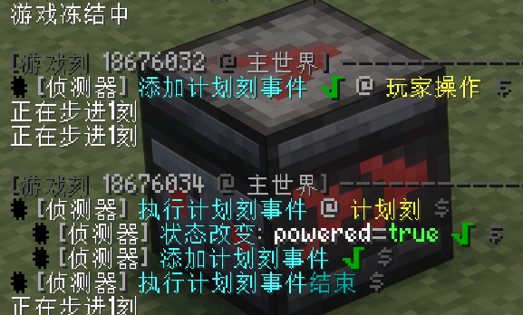

自熄灭侦测器是最普通的侦测器模式。
只要侦测器在2gt内只侦测到一个信号（**在执行亮起计划刻的那一刻没有收到别的PP更新**），都是自熄灭的侦测器。


### 6.1.2侦测器预熄灭模式

侦测器在执行亮起计划刻的那一刻内，如果在侦测器执行计划刻事件亮起之前，收到了一个PP更新。那么侦测器自检：
- 自己是熄灭的
- 在之后的游戏刻中没有已经安排的计划刻事件（本刻不算）

那么侦测器就会成功添加一个2gt后执行的计划刻事件。

侦测器本来收到PP更新是想添加一个计划刻事件用于亮起的，结果紧接着侦测器就会执行了它之前添加的亮起计划刻事件，后面这个新添加的计划刻事件就用来熄灭了。
这个侦测器的预期和实际产生的行为不同

这个熄灭计划刻添加模式便是侦测器的预熄灭模式
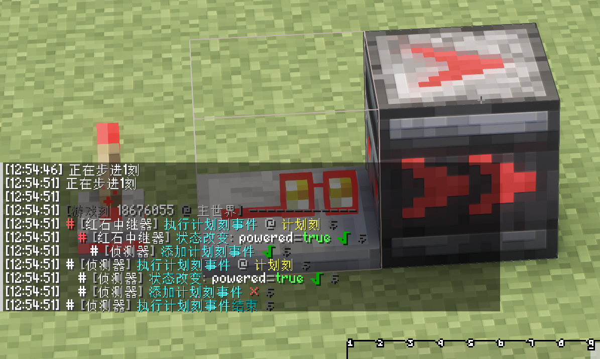

### 6.2两种模式在侦测器链中的传递性

事实上，这两种熄灭的方式可以在侦测器链中传递：
如果一个侦测器是自熄灭的，那么直接侦测它的侦测器也会是自熄灭侦测器
如果一个侦测器是预熄灭的，那么直接侦测它的侦测器也会是预熄灭的
> 你可以尝试推导一下

以上的前提都是玩家没有对侦测器进行活塞推拉，手动放置等一些奇怪的操作，事实上也有反例，在最后面的侦测器早链中也会介绍不用任何别的元件让信号从预熄灭变为自熄灭的例子


#### 6.2.1自熄灭链如何传递
自熄灭侦测器链的特点是**后方侦测器亮起比前方侦测器熄灭要早**

以下图为例：
1. 绿色侦测器执行计划刻事件（灭->亮）：
   1. 改变自己的状态，使后方的蓝色侦测器添加计划刻事件
   2. 给自己添加计划刻事件
2. 红色侦测器执行计划刻事件（亮->灭）

最后玩家观察到的现象就是只有中间的侦测器是亮起的状态
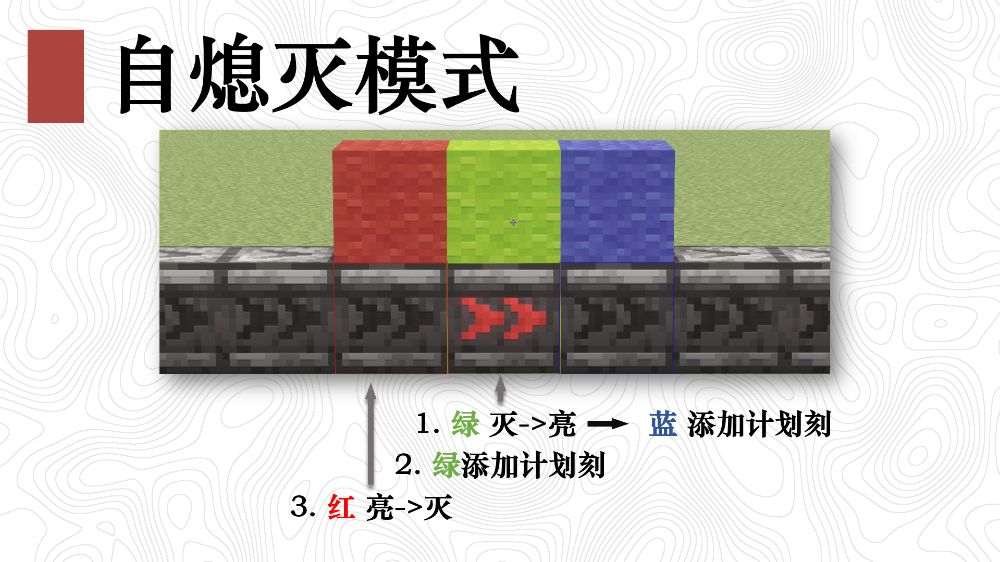
可以观察到，在这一gt内，依然是后面的蓝色侦测器要先添加计划刻事件，使得这个模式可以在侦测器链中被一直传递下去
**2gt后，红绿蓝三个侦测器的角色都会向后移动一格**，像波一样传播。

#### 6.2.2预熄灭链如何传递
预熄灭侦测器链的特点是**前方侦测器链的熄灭要比后方侦测器的亮起要早**

以下图为例，依然是这个红绿蓝侦测器的样子：
1. 红色侦测器执行计划刻事件（亮->灭）
   1. 改变自己的状态，使后方的绿色侦测器预添加计划计划刻事件
2. 绿色侦测器执行计划刻事件（灭->亮）
   1. 改变自己的状态，使后方的蓝色侦测器添加计划刻事件
   2. 绿色侦测器尝试添加计划刻事件，结果在前面已经添加过了，遂添加失败

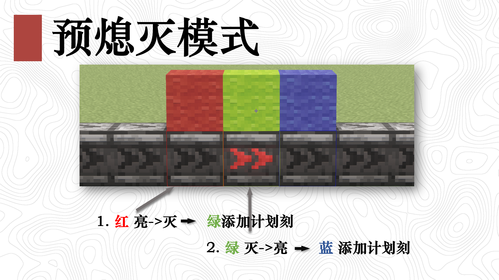
在这一gt内，绿色侦测器被预添加计划刻，是预熄灭状态，而且让自己的计划刻早于蓝色侦测器的计划刻添加，使得这个模式可以在侦测器链中被一直传递下去
同样的，**2gt后，红蓝绿三个角色都会向后传递一格**，像波一样传播。


### 6.3两种信号使用上的差异

预熄灭信号和自熄灭信号很像，但是略有不同，在使用的时候常常混用而造成很多奇怪的现象，特别是与优先级相同的计划刻元件之间的反应：比如红石火把，红石比较器，投掷器等

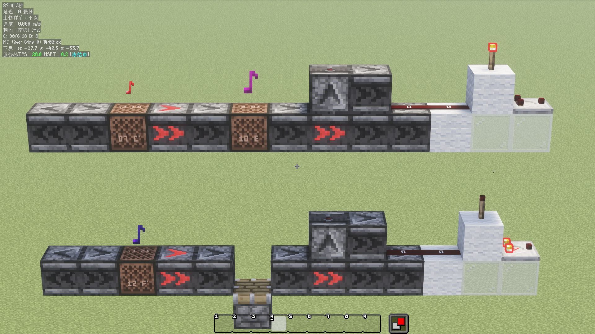

如上图所示：
从侦测器链中引出两个同状态的两个侦测器
- 上方的预熄灭信号红石火把没有反应，红石比较器没有反应
- 下方的自熄灭信号能够熄灭红石火把，点亮红石比较器

此外，还有侦测器链两个不同状态的的侦测器同时激活投掷器：
上方自熄灭的信号投掷器保持上升沿，无法喷物品
而下方预熄灭的信号投掷器有上升有下降，正常4gt喷出物品
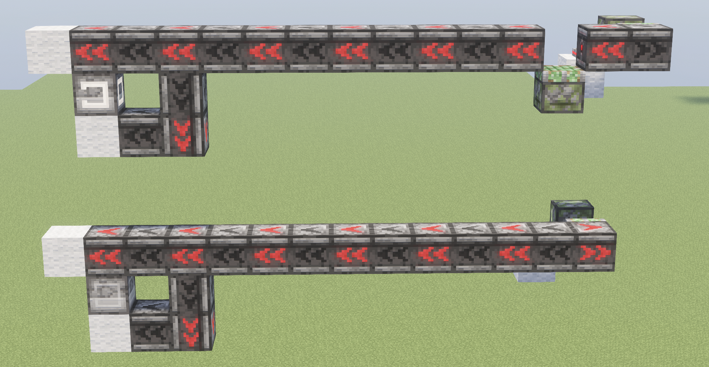

### 6.4两种信号互相转化

两种信号模式可以互相转化：
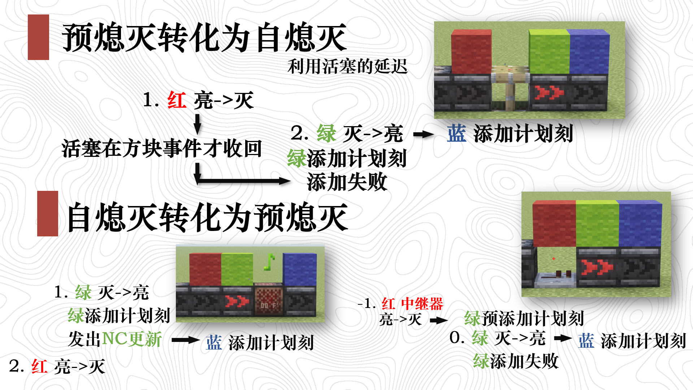
如上图所示

1. 预熄灭信号转为自熄灭信号：**使用在下降沿有延迟的元件**：比如活塞（只有活塞），使得前面添加计划刻事件的时机永远晚于后面的侦测器。
2. 自熄灭信号转为预熄灭信号：使用任何需要NC更新响应的瞬时原件（比如音符盒），或者计划刻优先级高的红石中继器。前者是延后后方侦测器的计划刻事件添加，后者是提前中间侦测器的计划刻添加
> 红石中继器可以在在大于等于6gt周期的信号中可以使用，但是在4gt周期的信号中就会导致侦测中继器的侦测器计划刻添加失败，从4gt变成6gt

### 6.5 预熄灭信号、自熄灭信号与脸对脸侦测器周期之间的关系：

首先，脸对脸的侦测器有6gt，4gt两种周期
6gt的是手放的，4gt的是活塞在非丢方块的情况下推出产生的
具体4gt和6gt发生了什么，可以看下面的图片：
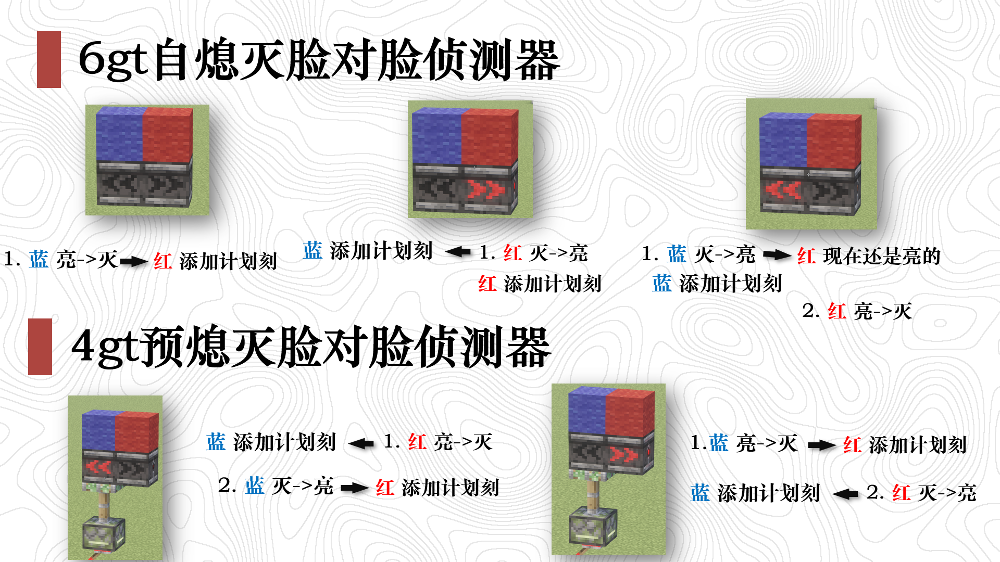
每一幅图片之间都是2gt,上面的6gt在三个状态之间来回切换
下面则是两个状态4gt.

1. 手放的脸对脸6gt侦测器，输出的是自熄灭的6gt信号。
2. 活塞正常推动造成的4gt脸对脸侦测器时钟，输出的是周期为4gt的预熄灭信号。


## 七、4gt侦测器链的几种情况与侦测器suborder顺序的分析

上方有关单个侦测器传输的信号类型在4gt链中不是非常方便。
上面分析的“波长”是三个侦测器，任意间隔大于6gt的信号都可以正常分析。
但是对于间隔为4gt的信号在侦测器链中的传输的情况，我们还需要讨论。

**suborder**可以看做是计划刻在优先级相同的情况下计划刻执行的顺序，越早添加值越小
以下均以计划刻执行最早的侦测器的suborder为1。

### 7.1  4gt输入侦测器链的自熄灭信号

始终输入的自熄灭信号可以通过在计划刻最后更新侦测器，或者直接在计划刻阶段后（活塞的方块事件）更新侦测器得到。

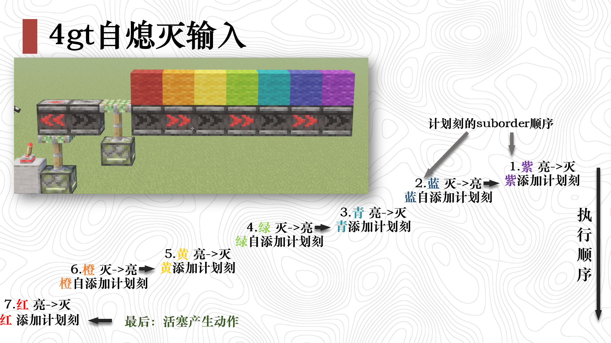

- 由于自熄灭信号传递的方式，后面侦测器计划刻添加的事件始终早于前面的侦测器，在侦测器链中，最末尾的侦测器的计划刻事件会被顶到最上面最先执行。
- 换句话说就是侦测器越靠后，计划刻执行时间越早，计划刻的suborder越小。

我们不妨称这种suborder沿着侦测器链信号传递方向严格减小的传递模式称为**严格早链**

这样的信号模式也给这个侦测器链非常强大的稳定性：
- 要么侦测器自己添加熄灭计划刻。
- 要么侦测器执行了计划刻已经熄灭了，然后又被前面的侦测器发生的变化叫醒添加计划刻
> 总之，无论其中的侦测器的状态怎么样，都能成功添加计划刻事件。

所以，你可以把严格早链中的亮起侦测器任意的替换成熄灭侦测器，就可以出现几个侦测器连在一起亮，信号还能正常传递的奇观。
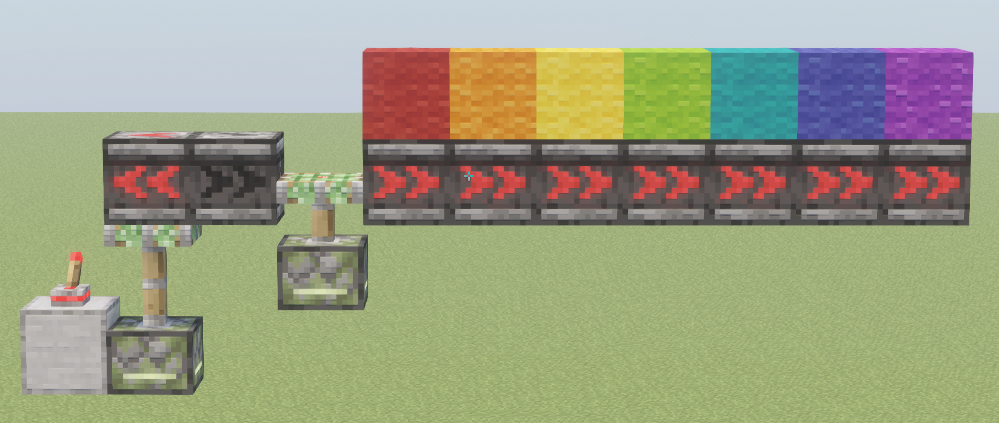

### 7.2 4gt输入侦测器链的预熄灭信号

如果输入侦测器链的是预熄灭信号，那就相当复杂：
不过有一点是确定的：
-  **（准备让侦测器熄灭的）熄灭计划刻的suborder一定小于亮起计划刻的suborder**
-  也就是说侦测器一定先熄灭后亮起

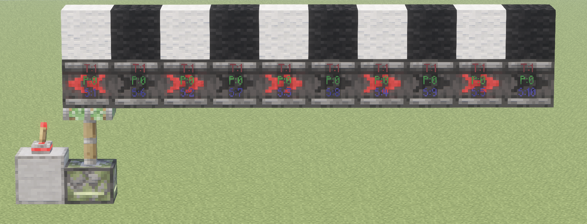
注意看侦测器上最下面的蓝色S:是suborder的大小，可能有点看不太清
**从左到右**依次是 1,6,2,7,3,8,4,9,5,10,分开来看
- 马上要熄灭的侦测器(图中白色羊毛)的suborder大小是:1,2,3,4,5
- 马上要亮起的侦测器(图中黑色羊毛)的suborder大小是:6,7,8,9,10

可见4gt预熄灭侦测器链依然保持着先熄灭后亮起的特点
上述的侦测器链同种颜色的的suborder是从开头到末尾suborder是逐步增大的，
这种模式被称作**晚链**

同样的，还有一种**早链**
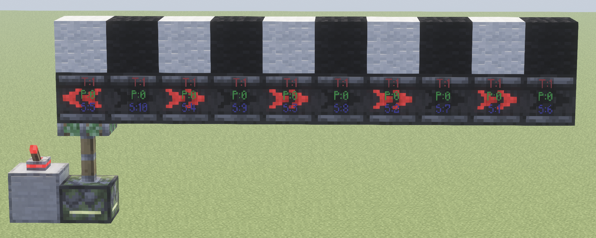
**从左到右**：
- 马上要熄灭的侦测器(图中白色羊毛)的suborder大小是:5,4,3,2,1
- 马上要亮起的侦测器(图中黑色羊毛)的suborder大小是:10,9,8,7,6

这种沿着传播的方向同种颜色的suborder逐渐减小的模式叫做**早链**

这种预熄灭信号导致的早链虽然不是上方介绍的**严格早链**，但是仍然具备转化为严格早链的能力：只要把其中一个亮起的侦测器打掉再放下，让其状态变为熄灭，就能构建出一个和上方严格早链子类似的同时亮起同时熄灭的状态，将后方的侦测器传染为**严格早链**，后方传递的信号也会转化为自熄灭信号
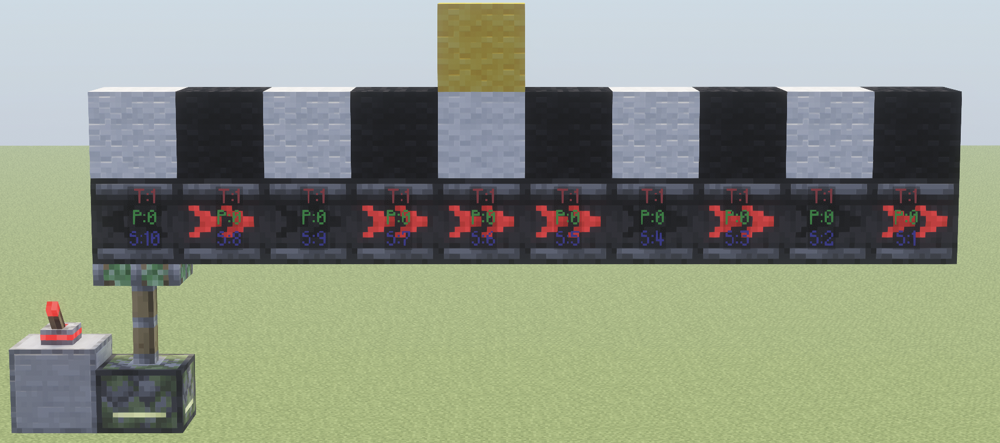
从左到右：10,8,9,7,**6**,5,4,3,2,1

如图所示，重放黄色标记的侦测器，后方的侦测器链都被转化成了suborder严格减小的严格晚链.

### 7.2.1 晚链，早链的确定方法
从一个4gt的预熄灭脸对脸的侦测器时钟中引出的信号可以是**晚链**，可以是**早链**，这如何确定呢？

引用Ryan100c的判断晚链，早链的方法：
1. 设置脸对脸侦测器的其中一方为分析起点
2. 围绕判断起点以看向判断起点的侦测器为第一层侦测器，按PP更新顺序，给他们打上数字标记
3. 从1号侦测器开始，按照广度优先，为剩下的侦测器都打上标记，注意，分析起点没有被标记，依然可以被**分析起点面朝着的的侦测器**打上标记
4. 分析原点后有标记之后，任何标记数字小于分析原点的侦测器印出来的侦测器链都是**早链**，其余为**晚链**

> PP更新的顺序是-x,+x,-z,+z,-y,+y
>下图中红色为x+,蓝色为z+,绿色为y+

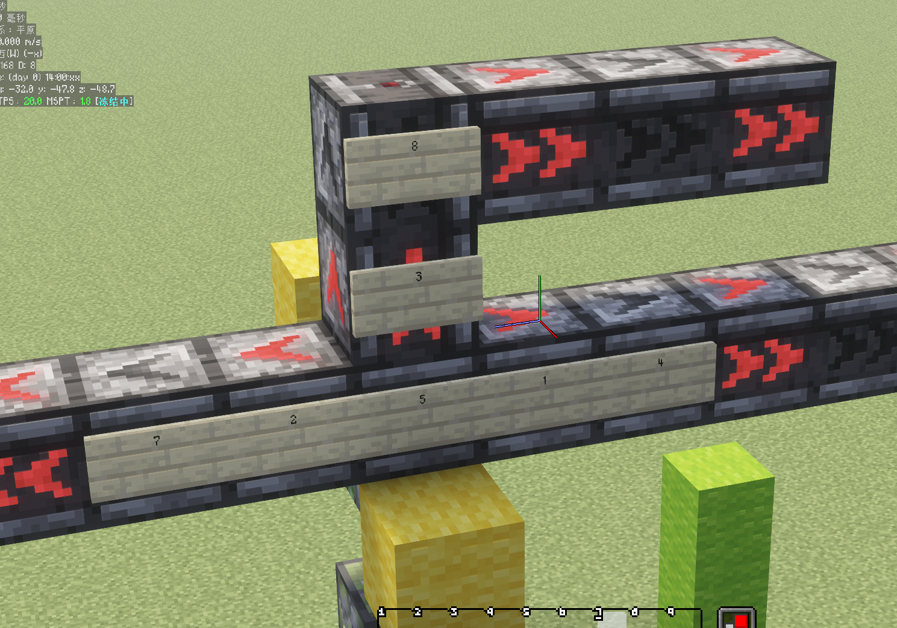

以活塞推动的侦测器为分析原点（黄色羊毛）（标记为5）
可以分析得到如图所示的侦测器顺序
这足以判断右边的侦测器链是**早链**
上面和左边的侦测器链是**晚链**

---

特别鸣谢：Ryan100c、金合欢酱、以及OSTC里的各位

---

[^1]： 其实计划刻并没有存储具体执行计划刻事件的时候会发生什么，这里亮起计划刻和熄灭计划刻的说法是为了表述方便。