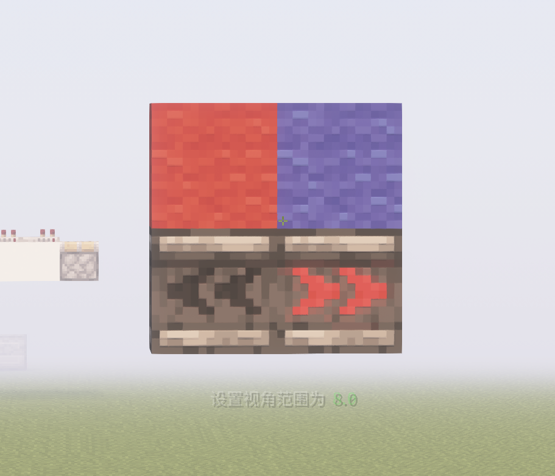
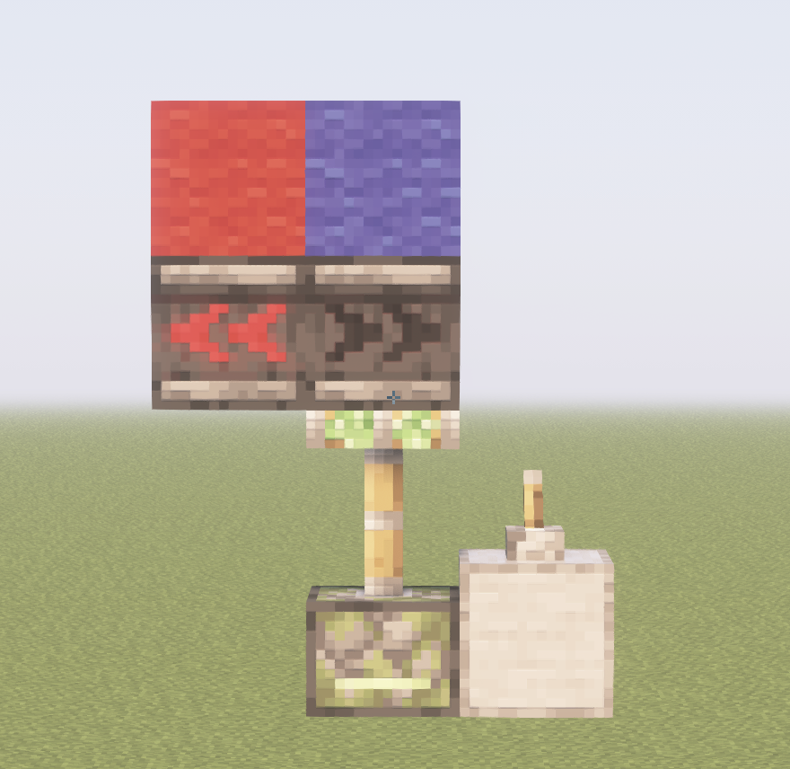
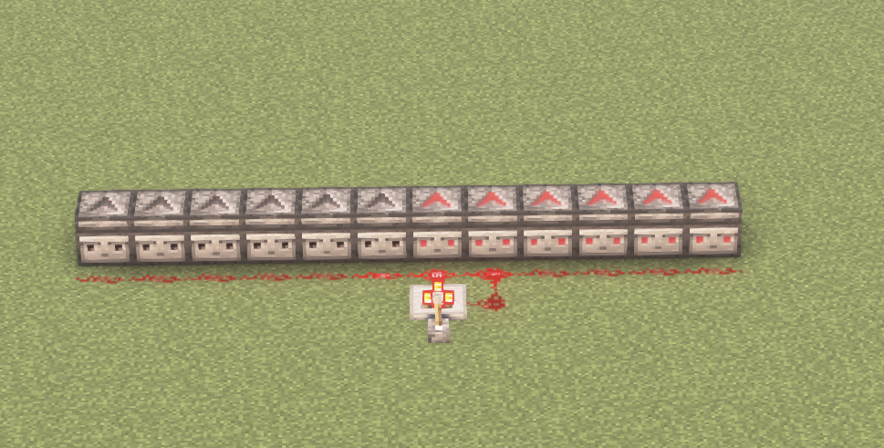

# 老生常谈的侦测器4gt/6gt问题

## 一.起因
脸对脸侦测器能产生周期为4gt或6gt的高频早已经不是什么新鲜事情了

B站上关于这个的分析也已经有很多了

但我今天将会详细彻底的剖析侦测器的行为和4gt/6gt区别的根源
还写了详细的缩进,应该会更加容易理解

**玩家直接放置和活塞0t瞬间到位会引发周期为6gt的侦测器高频**
**活塞正常的推出会引发周期为4gt的侦测器高频**

但是最近在分析侦测器时候发现:侦测器在侦测4gt时钟的时候似乎也会表现出4gt/6gt两种不同的现象.
仔细想一想,发现二者在核心逻辑上似乎有相似之处,干脆写个专栏,把侦测器的东西打通,希望能够给您带来些许帮助

## 二.结论
先说结论:**侦测器周期为4/6的决定因素是在侦测器熄灭的那一游戏刻.**
- 如果侦测器在该游戏刻成功添加了计划刻,则侦测器的周期为4gt;
- 如果侦测器在该游戏刻没有添加成功计划刻,那只能等到2gt后再添加计划刻,周期就是6gt

这就是==核心==,如果您已经get到了核心,到这里就可以离开啦.

***
## 三.计划刻的特点
这里是为没有详细了解计划刻事件的人准备的,如果您已经对计划刻事件有所了解,完全可以跳过这一部分

简单来说,计划刻就是方块向游戏请求一个计划在指定游戏刻后执行的任务，而规划请求的这项计划任务被称为计划刻

具体计划刻的执行时间的计算为:
```
实际执行时间 = 当天时间 + 计划刻延迟
```
一个方块任意时刻,只能拥有一个计划刻,已经有一个计划刻后,添加计划刻会失败

**特别的:如果已有计划刻在本游戏刻内执行,那在该游戏刻还是可以添加新的计划刻的**

同一游戏刻,计划刻的执行顺序:
- 先看计划刻优先级,小的优先
- 再看计划刻添加的顺序,先添加的优先
侦测器的优先级都是0,所以可以看为哪个侦测器先添加计划刻事件,哪个侦测器先执行计划刻事件.


## 四.侦测器的行为

侦测器是典型的计划刻元件，其行为依赖计划刻事件，当侦测器执行计划刻事件时，如果侦测器是熄灭状态，则亮起，如果侦测器是亮起状态，则熄灭，具体行为如下：

侦测器在面前的方块状态发生变化时，会添加一个延迟为2游戏刻的计划刻事件，在2游戏刻后，执行该计划刻事件，依次执行以下操作：

1. 将自身方块状态设为亮起（powered:false->true）
2. 发出状态更新
3. 添加延迟2游戏刻的计划刻事件
4. 发出方块更新

又再在2游戏刻后，侦测器执行计划刻事件，此时侦测器为亮起状态，依次执行以下操作：

1. 将方块状态设为熄灭（powered:true->false）
2. 发出状态更新(pp更新)
3. 发出方块更新(nc更新)

侦测器的计划刻优先级均为0（NORMAL）。

~~*顺便说一嘴,我看wiki上没有,就扩写了一点wiki*~~

好啦,了解了侦测器的行为,我们啾可以来正式分析侦测器的微时序啦.

## 五.对脸侦测器发生了什么

这里我推荐大家用Carpet TIS Addition自己尝试看一看
```
/carpet microTiming true
/carpet microTimingDyeMarker true
/carpet microTimingTarget marker_only
/log microtiming
```
这样就能用染料标记需检测的红石原件了.

我这里就把我看到的侦测器发生什么了写出来吧

- **手放6gt:**
1. gt0-NU阶段:
    - 玩家放置蓝色侦测器
    - - 导致红色侦测器添加计划刻(2gt)
2. gt2-计划刻0:
   - 红色侦测器执行gt0的计划刻事件
   - -  powered=true
   - - 发出状态更新
   - - - 蓝色侦测器侦测到状态更新,添加计划刻(2gt)
   - - 红色侦测器添加计划刻(2gt)
   - - 红色侦测器发出NC更新(因为没有需要NC更新的东西,所以这一步在之后都不会写了) 
   - 红色侦测器结束执行计划刻事件
 **这一游戏刻中,因为侦测器发出PP更新在添加计划刻之前就进行了,被蓝色侦测器发现,领先一步红色侦测器添加了计划刻,这也是6gt直接的原因,继续往下看.**
3. gt4-计划刻0:
   - 蓝色侦测器执行在gt2添加的计划刻事件:
   - - powered = true
   - - 发出pp更新,但此时**红色侦测器为亮起状态**,所以**没有添加计划刻**
   - - 蓝色侦测器添加计划刻事件(2gt)
   - 蓝色侦测器结束执行计划刻事件
   - 红色侦测器执行在gt2天假的计划刻事件:
   - - powered = f
   - - 发出PP更新,此时蓝色侦测器也为亮起状态,所以也没有添加计划刻事件
   - 红色侦测器结束执行计划刻事件
   **这一游戏刻便是最关键的一游戏刻,红色侦测器执行计划刻事件在蓝色侦测器之后.**
   **蓝色侦测器状态发生变化的时候,红色侦测器仍亮起,错过了添加计划刻事件的机会.**
   **在熄灭时未能马上添加计划刻事件,只能等待蓝色侦测器再次变化才能添加计划刻事件,多等了2gt.**
4. gt6-计划刻0:
    - 蓝色侦测器执行在gt4添加的计划刻事件:
    - - powered = f
    - - 发出更新
    - - - 红色侦测器添加计划刻事件(2gt)
    - 蓝色侦测器执行计划刻事件结束
   **这一游戏刻,红色侦测器添加了计划刻,蓝色侦测器灭了,和gt0的情况一样,因此,周期为6-0=6gt**

**总结一下**:
如果侦测器想要拥有较快的4gt周期的话:
- 2gt等待执行亮起计划刻[^1]
- 2gt等待执行熄灭计划刻
- 2gt等待执行亮起计划刻
- 2gt等待执行熄灭计划刻
- ......
也就是说,在侦测器执行计划刻熄灭的同一游戏刻,必须添加新的计划刻用于亮起

而反观手放侦测器的6gt
- 2gt等待亮起计划刻
- 2gt等待熄灭计划刻
- 2gt没有计划刻
- 2gt等待亮起计划刻
- 2gt等待熄灭计划刻
- 2gt没有计划刻
- ......
这就高下立判了,如果错过了熄灭时添加计划刻,那只能等到2gt后蓝色侦测器再次变化才能添加计划刻,浪费了2gt时间,导致了6gt的周期.

**那么,4gt周期的侦测器到底发生了什么呢?**
- **活塞推4gt**

1. gt0-NU:
 - 拉杆:powered=t
 - - 发出更新
 - - - 粘性活塞:添加方块事件
 - - 发出更新结束
2. gt1-BE:
   - 活塞执行方块事件:
   - 将空气变成b36,发出pp更新
     - 红色侦测器添加计划刻事件 (2gt)
   - 蓝侦测器变成b36(b36将在2gt后TE阶段固化)
3. gt3- 计划刻0:
   - 红色侦测器执行计划刻:
   - - powered = t
   - 添加计划刻(2gt)
    gt3-TE阶段:
    - 蓝色侦测器:添加计划刻事件(2gt)
    - b36全部固化
4. gt5 -计划刻0:
   - 红色侦测器执行计划刻事件:
   - - powered = f
   - - 发出更新
   - - - **蓝色侦测器添加计划刻事件(2gt)**
   - 蓝色侦测器执行计划刻事件:
   - - powered = t
   - - 发出pp更新
   - - - 红色侦测器:添加计划刻事件(2gt)
   - - 蓝色侦测器:添加计划刻事件(2gt)失败
  **这是侦测器能实现4gt周期最关键的地方,请看该游戏刻蓝色侦测器添加计划刻的时候,它自己的计划刻还没有执行呢,就被红色侦测器的熄灭更新到了,添加了计划刻,怎么回事?我们来分析一下蓝色侦测器怎么想的:**

  蓝色侦测器:
  - 收到PP更新:
  - 检查:
  - - 我当前的状态是熄灭(powered=false)收到更新应该可以亮起
  - - 我在之后的游戏刻没有计划刻任务(因为计划刻将在本游戏刻执行)
  - 很好,那我就添加一个计划刻事件用于亮起吧!

结果是:在下一瞬间,蓝色侦测器就执行了一次计划刻事件变成了亮起,这个新添加的本应该用于亮起的计划刻,在之后成了让蓝色侦测器熄灭的计划刻事件.
红色侦测器也在这一过程中在同一游戏刻完成了从执行计划刻变成熄灭状态到添加新的计划刻

这样一来,蓝色侦测器,添加计划刻就在红色中继器之前了.

5. gt7- 计划刻0:
   - 蓝色侦测器执行计划刻事件:
   - - powered = f
   - - 发出更新
   - - - **红色侦测器添加计划刻事件(2gt)**
   - 红色侦测器执行计划刻事件:
   - - powered = t 
   - - 发出PP更新
   - - - 蓝色侦测器添加计划刻事件(2gt)
   - - 红色侦测器:添加计划刻失败
  
  可以观察到,gt7与gt5的操作完全一样,只是红色侦测器和蓝色侦测器的角色发生了完全调换.

就这样,侦测器实现了4gt周期的高频


## 六.侦测器的其他周期问题
利用核心:
侦测器熄灭时能否立刻再添加计划刻便可以解释侦测器侦测其他周期为4gt/6gt的情况
### 1.侦测比较器高频

侦测器在侦测比较器高频时,红石粉都是同时变化的
但是有的侦测器周期为4gt,有的侦测器周期为6gt.
而且谁为4gt谁为6gt显示出红石粉的方向性和位置性,改变红石粉的连接方式也会改变周期.
其实是红石粉更新顺序的问题,比较器和侦测器同为优先级0
- 比较器先添加计划刻,侦测器在熄灭时比较器已经变化完成,就只能等到2gt后再添加计划刻事件,周期就为6gt
- 如果侦测器比比较器先添加计划刻,侦测器熄灭后,比较器在侦测器之后执行计划刻事件,则侦测器在熄灭后就能侦测比较器产生的红石粉信号变化而添加计划刻,周期就为2gt.


## 七.尾声
所以在对时序要求严格的机器里面一定要注意侦测器是4gt还是6gt


[^1]:这里亮起计划刻和熄灭计划的说法只是为了方便理解计划刻最后的用途,计划刻并未储存方块实际执行的动作,在后文4gt的侦测器循环中就出现了添加计划刻的用途和实际计划刻的用途不一致的情况